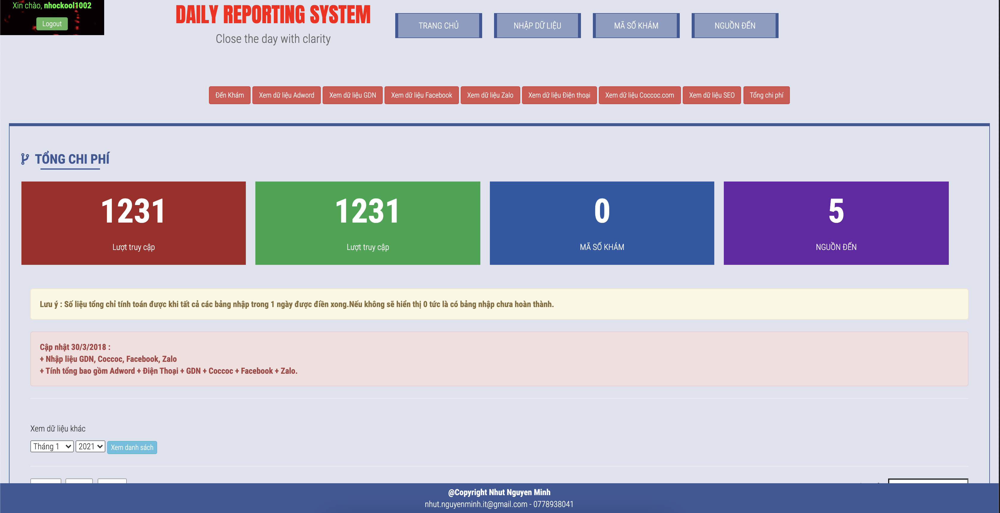
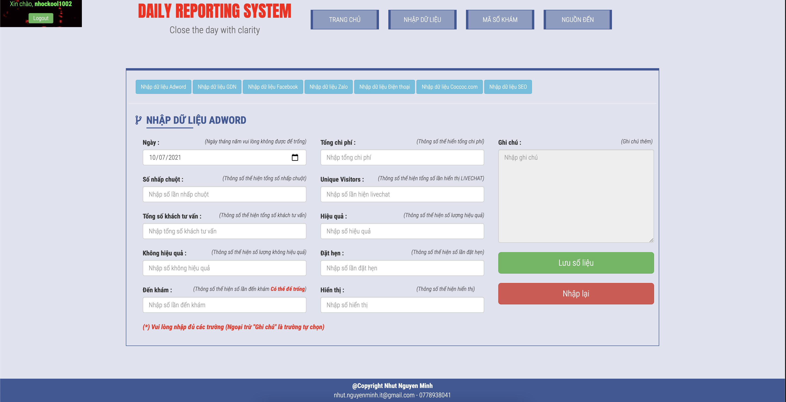
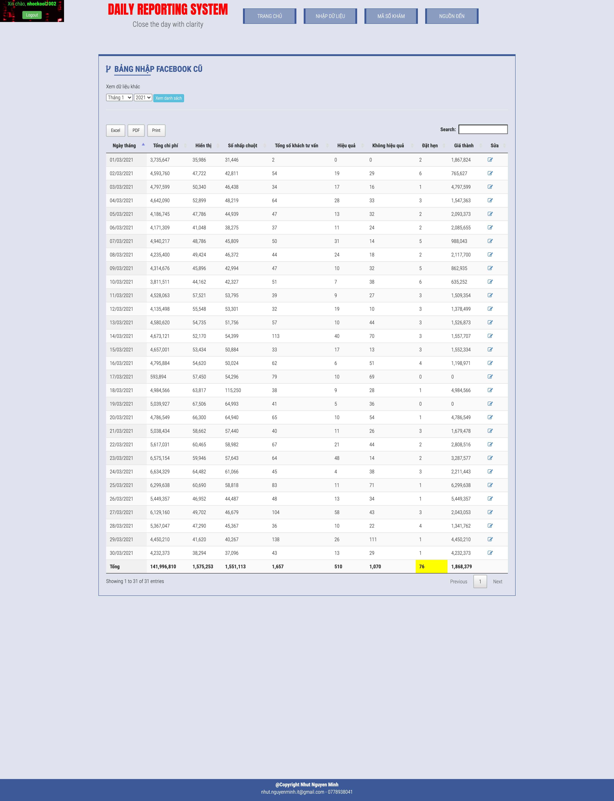
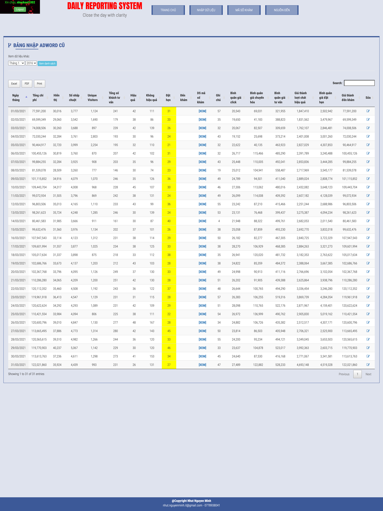
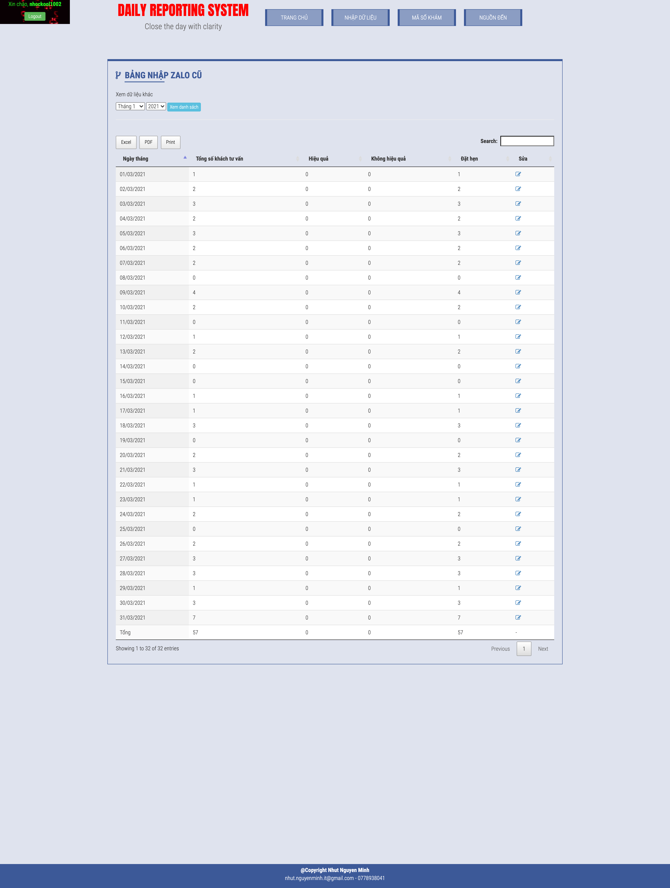
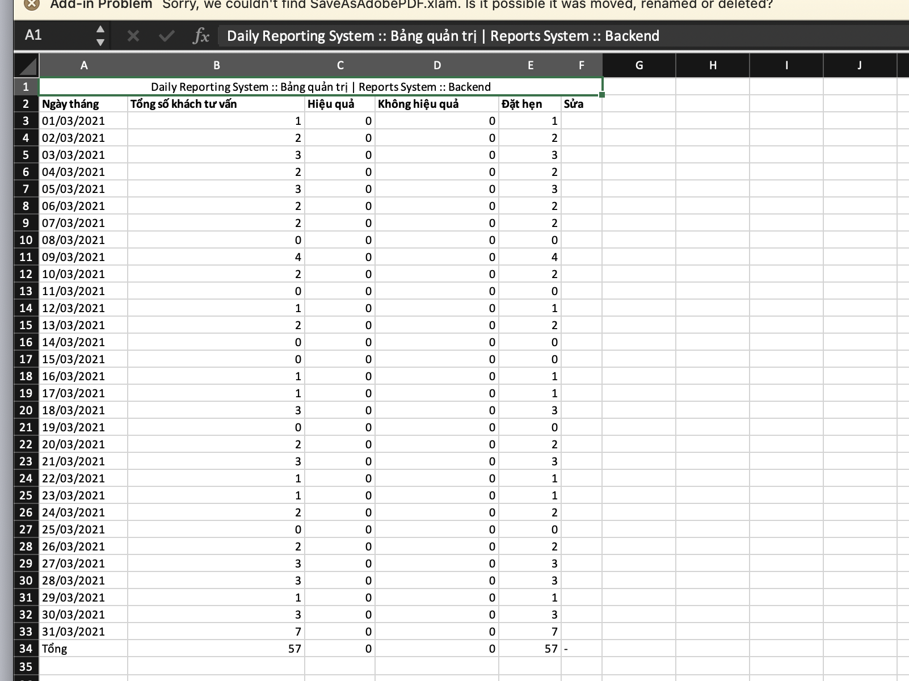
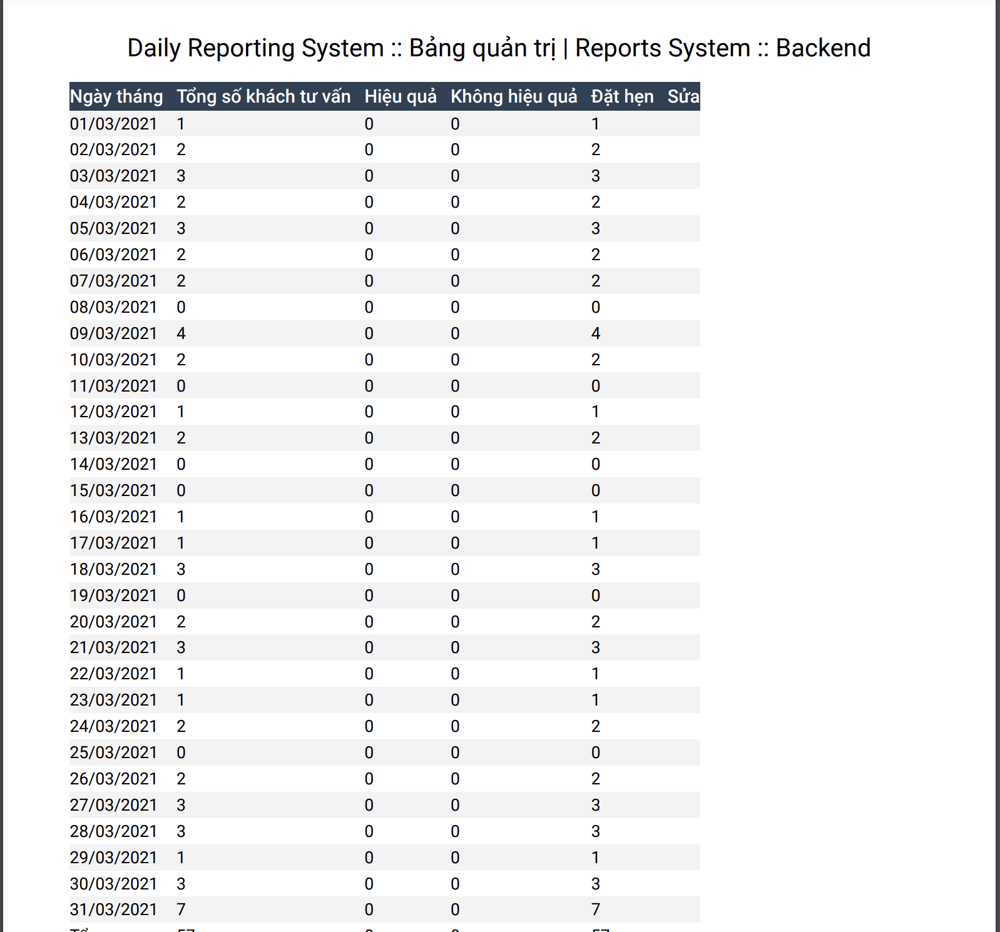

# **Daily Reporting System - Hệ thống báo biểu**

## **Description - Mô tả**
- **Daily Report System** is a system that calculates the details including total cost, effectiveness, number ... of Social Marketing channels. Also can export Excel/PDF to support reporting.

- **Daily Report System** là một hệ thống tính toán các chi tiết bao gồm tổng chi phí, hiệu quả, số lượng ... của các kênh Social Marketing. Đồng thời có thể xuất Excel/PDF để hổ trợ việc báo cáo.

## **Setup - Cài đặt**
- Go to _**config/config.php**_ and setup informations - Di chuyển tới _**config/config.php**_ và cài đặt các thông tin
> $hostname = '';  
> $username = '';  
> $password = '';  
> $dbname = '';

- Import _**notification/config.php**_ into databases - Nhập _**notification/config.php**_ vào cơ sở dữ liệu

- Go to _**localhost/login.php**_ and login with below info - Di chuyển tới _**localhost/login.php**_ và login với thông tin bên dưới
> username: root  
> password: 111111  

## **Picture - Hình ảnh**

**General - Tổng quan**

**Form Typing - Nhập dữ liệu**

**Full Page Facebook Data - Trang đầy đủ dữ liệu Facebook**

**Full Page Adwords Data - Trang đầy đủ dữ liệu Adwords**

**Full Page Zalo Data - Trang đầy đủ dữ liệu Zalo**

**Export Excel - Xuất Excel**

**Export PDF - Xuất PDF**

